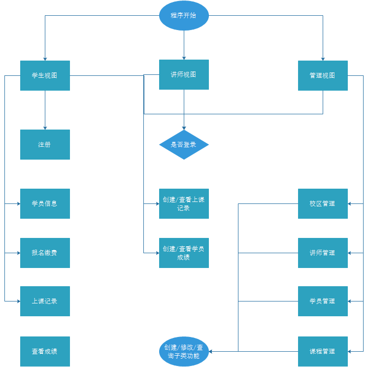

# days6作业-选课系统：

角色:学校、学员、课程、讲师

>作业需求    

- [ ] 1.创建北京、上海 2 所学校
- [ ] 2.创建linux , python , go 3个课程 ， linux\py 在北京开， go 在上海开
- [ ] 3.课程包含，周期，价格，通过学校创建课程 
- [ ] 4.通过学校创建班级， 班级关联课程、讲师
- [ ] 5.创建学员时，选择学校，关联班级
- [ ] 5.创建讲师角色时要关联学校， 
- [ ] 6.提供两个角色接口，一个管理接口   
    6.1学员视图， 可以注册， 交学费， 选择班级    
    6.2讲师视图， 讲师可管理自己的班级， 上课时选择班级， 查看班级学员列表 ， 修改所管理的学员的成绩     
    6.3管理视图，创建讲师， 创建班级，创建课程    
- [ ] 7.上面的操作产生的数据都通过pickle序列化保存到文件里


[ssmqfl的博客地址](http://www.cnblogs.com/ssmqfl/articles/8882619.html)

## 1. 程序说明
实现功能如下

- [x] 1.创建北京、上海2所学校
- [x] 2.创建linux,python,go3个课程，linux\py在北京开，go在上海开
- [x] 3.课程包含，周期，价格，通过学校创建课程
- [x] 4.通过学校创建班级，班级关联课程、讲师
- [x] 5.创建学员时，选择学校，关联班级
- [x] 5.创建讲师角色时要关联学校
- [x] 6.提供两个角色接口，一个管理接口
    6.1学员视图，可以注册，交学费，选择班级    
    6.2讲师视图，讲师可管理自己的班级，上课时选择班级，查看班级学员列表，修改所管理的学员的成绩     
    6.3管理视图，创建讲师，创建班级，创建课程    
- [x] 7.上面的操作产生的数据都通过pickle序列化保存到文件里

## 2. 思路和程序限制

首先设置限制：    

    1. 学员有地域限制，不能同时选择北京和上海学校；   
    2. 为避免课程冲突，学员只能选择一个课程，且不考虑历史选课；
    3. 讲师上课时只能选择一个班级；
    4. 讲师周一到周日都可选择班级授课，一日一课程，一周最多7个班级；
    5. 一个帐号只属性一个人，帐户使用用户名登录，对应唯一ID，即学号；
    6. 一个班级可能对应多个讲师；

按帐号区分视图：

    1. 学员帐号
        属性：学号、班级、学校、课程、成绩、名字；
        方法：注册、登录、报名缴费、查看上课记录、查看成绩；
    2. 导师帐号
        属性：名字、授课班级、学校、授课课程、工资；
        方法：登录、创建上课记录、创建学员成绩、查看学员上课记录、查看学员成绩；
    3. 系统帐号
        属性：名字、管理员权限
        方法：创建班级、分配学员班级、创建课程、创建讲师、管理员功能

 从程序上来设计：

    1. 人类：属性有名字、年龄、性别；
    2. 城市类：属性有城市名；
    3. 学校类：属性有学校名；
    4. 班级类：属性有班级名，学员，和学员一对多关系；
    5. 学生类：继承基本类人，有其它属性选课、成绩，和班级（一对一）；
    7. 讲师类：继承基本类人，有其它属性教的课程；
    7. 课程类：属性有课程名，价格，；
    8. 帐户类：属性有帐号名、密码、状态、角色；（与人一对一）

简单流程图：


## 3. 选课系统程序目录结构

```
.
│
├─bin # 可执行程序入口目录
│      course_start.py # 程序入口
│
├─conf # 配置文件目录
│  │  settings.py  # 配置文件
│  │  __init__.py
│  │
│  └─__pycache__
│          settings.cpython-36.pyc
│          __init__.cpython-36.pyc
│
├─core # 选课系统主要逻辑程序目录
│  │  main.py # 主程序模块
│  │  uid.py # 生成随机名
│  │  __init__.py
│  │
│  └─__pycache__
│          main.cpython-36.pyc
│          uid.cpython-36.pyc
│          __init__.cpython-36.pyc
│
├─db
│  ├─admin # 管理员目录
│  │      admin.json # 管理员账号
│  │
│  ├─classes # 班级目录
│  │      6134ee59c228cb944626d22770e763a7
│  │      d9a1d83d262c9035ce6f335ce10cbb03
│  │      f8997d03fe0f2f103655b80cb2a379e9
│  │
│  ├─class_grade #课程成绩
│  │      4419972077a4e0ea3b4a29e328a7185c
│  │      9ebe62accc13efc16b163f3e3fb923ea
│  │
│  ├─class_record # 上课记录
│  │      cb3ac5ae9ff66a59568a47b5e4cc7f34
│  │      ffc813d991304f302119e73da571a2e8
│  │
│  ├─course # 课程目录
│  │      038d45d8c710769bfb5a2c794fbde79e
│  │      59489cf043c5fbf9ba28da01453b34e7
│  │      8a719721babc0afca59a41afa6eb7ddf
│  │
│  ├─school # 学校目录
│  │      3aa75bbf03c33846afd9c431ae120a20
│  │      d39e3263f7abf288ae2d757d102b735b
│  │
│  ├─student # 学生目录
│  │      37cdf07276833df87996a7d4263be2f4
│  │      7ffd851e022951332b6109d0e077ee63
│  │
│  └─teacher # 讲师目录
│          39695c389e1d978babfd2069cdcb5811
│          alex.json
│          d9b676ce8389e87eb406dc9e74493cd5
│          eb19d58af9962be68cf2d07d2b0b6218
│
├─lib # 逻辑目录
│  │  admin.py # 管理员逻辑处理
│  │  base.py # 基本逻辑处理
│  │  classes.py # 班级逻辑处理
│  │  course.py # 课程逻辑处理
│  │  school.py # 学校逻辑处理
│  │  student.py # 学员逻辑处理
│  │  teacher.py # 讲师逻辑处理
│  │  __init__.py
│  │
│  └─__pycache__
│          admin.cpython-36.pyc
│          base.cpython-36.pyc
│          classes.cpython-36.pyc
│          course.cpython-36.pyc
│          school.cpython-36.pyc
│          student.cpython-36.pyc
│          teacher.cpython-36.pyc
│          __init__.cpython-36.pyc
│
└─log
```

## 4. 测试帐户说明
系统帐户：
admin/admin
讲师帐户：
alex/alex
学员帐户：
eric/123

## 5. 程序测试过程

```

            --------欢迎进入选课系统--------
            1.学生视图
            2.讲师视图
            3.管理视图
            4.退出系统
            
        
请选择视图:3
输入用户名:admin
输入密码:admin

        ------- 欢迎进入管理视图 ---------
             1.  校区管理
            2.  讲师管理
            3.  学员管理
            4.  课程管理
            5.  返回
            
请选择：4

                ------- 欢迎进入课程管理 ---------
                 1.  创建课程
                2.  ...
                3.  返回
                
            
请选择：1
课程名：java
周期：20
价格：16000
------course创建成功------
课程名 :	 java
周期 :	 20
价格 :	 16000
uid :	 d13cda467c3c0edf755c86298137c4f4

                ------- 欢迎进入课程管理 ---------
                 1.  创建课程
                2.  ...
                3.  返回
                
            
请选择：3

        ------- 欢迎进入管理视图 ---------
             1.  校区管理
            2.  讲师管理
            3.  学员管理
            4.  课程管理
            5.  返回
            
请选择：1

                ------- 欢迎进入校区管理 ---------
                1.  创建校区
                2.  创建班级
                3.  返回
                
            
请选择：2
班级名：java1
负责讲师：lili
所学课程：java
------classes创建成功------
班级名 :	 java1
负责讲师 :	 lili
课程 :	 java
uid :	 04eefea8e142db40ecf69a4ef7e9a53e

                ------- 欢迎进入校区管理 ---------
                1.  创建校区
                2.  创建班级
                3.  返回
                
            
请选择：3

        ------- 欢迎进入管理视图 ---------
             1.  校区管理
            2.  讲师管理
            3.  学员管理
            4.  课程管理
            5.  返回
            
请选择：2

                ------- 欢迎进入讲师管理 ---------
                 1.  创建讲师
                2.  ...
                3.  返回
                
            
请选择：1
讲师姓名：lili
讲师工资：20000
所属学校：oldboy2
{'姓名': 'lili', '工资': '20000', '所属学校': 'oldboy2'}
------teacher创建成功------
姓名 :	 lili
工资 :	 20000
所属学校 :	 oldboy2
uid :	 583c43cc1c503fca87c8c7a15064ef0e

                ------- 欢迎进入讲师管理 ---------
                 1.  创建讲师
                2.  ...
                3.  返回
                
            
请选择：3

        ------- 欢迎进入管理视图 ---------
             1.  校区管理
            2.  讲师管理
            3.  学员管理
            4.  课程管理
            5.  返回
            
请选择：5

            --------欢迎进入选课系统--------
            1.学生视图
            2.讲师视图
            3.管理视图
            4.退出系统
            
        
请选择视图:1

            1.注册
            2.登录
            3.返回
        
请选择:2
请输入用户名:eric
请输入密码:123

                            1.学员信息
                            2.报名缴费
                            3.查看上课记录
                            4.查看成绩
                            5.返回
                        
请选择:1
user : eric
pwd : 123
uid : 7ffd851e022951332b6109d0e077ee63
school : oldboy1
classes : py01
course : python
pay_state : True

                            1.学员信息
                            2.报名缴费
                            3.查看上课记录
                            4.查看成绩
                            5.返回
                        
请选择:5

            1.注册
            2.登录
            3.返回
        
请选择:3

            --------欢迎进入选课系统--------
            1.学生视图
            2.讲师视图
            3.管理视图
            4.退出系统
            
        
请选择视图:4
###################### 谢谢使用 ######################

```
